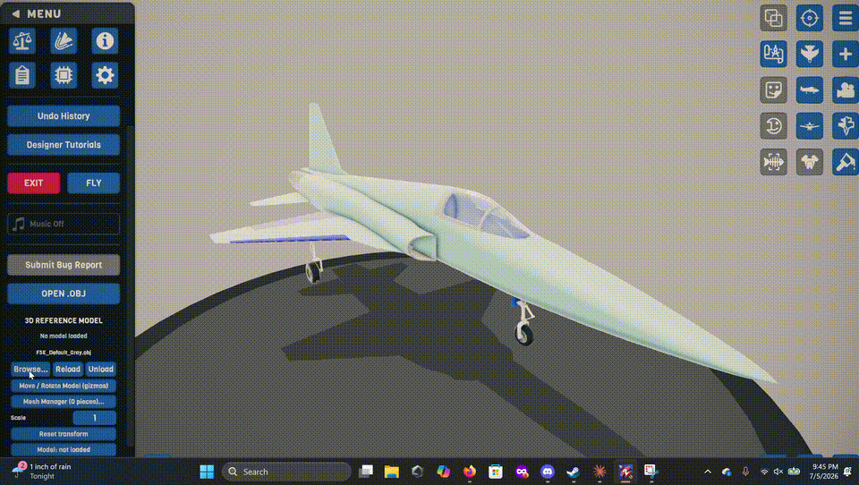
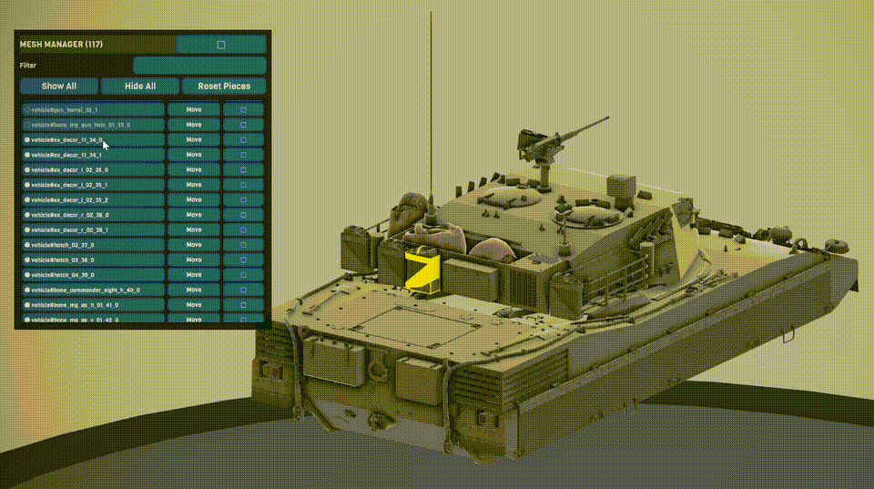
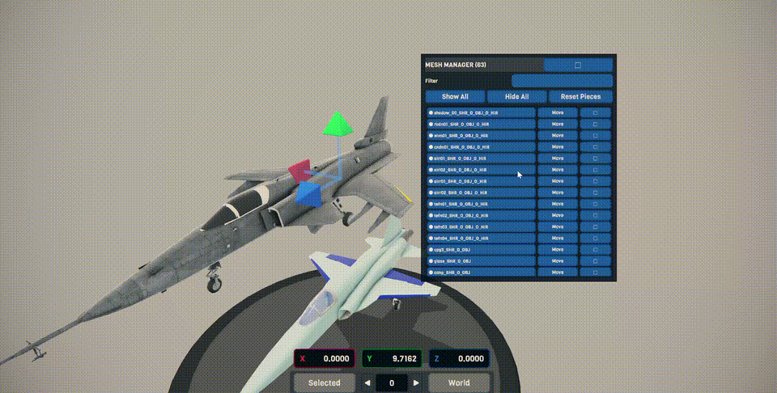
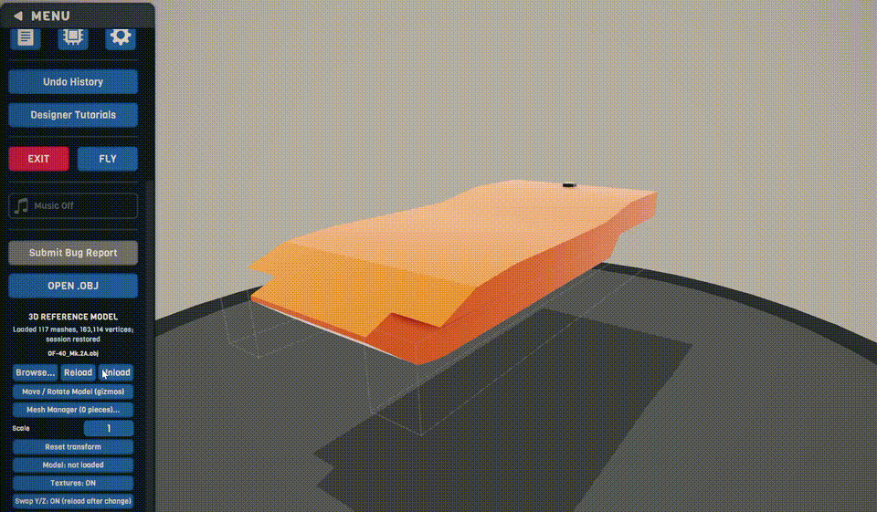

# SP2 Reference Model

Runtime OBJ/MTL reference-model loader for the SimplePlanes 2 designer.

1. Open the designer **Main Menu** and expand **3D Reference Model**.
2. Click **Open OBJ...** and pick a model with the file browser
   (or drop files under `BepInEx/config/SP2ReferenceModel/Models/` and click Reload).
3. Click **Move / Rotate Model** to position it with the game's own gizmos —
   press **2** for the translate gizmo, **3** for the rotate gizmo,
   **Done** to apply or **Esc** to cancel (restores the previous pose).

Models load plain white by default; the **Textures** toggle switches the MTL
colors and textures on. The model is visual-only, is not added to craft XML,
has no colliders, and disappears outside the designer. Named OBJ objects/groups
become individually toggleable mesh entries in paged native controls.

## Usage examples

Load an OBJ reference model, then move and rotate it with the in-game designer
gizmos:

Use the reference model while refining a craft in the designer:

Edit and translate orientation of mesh submodules:

Restore a saved session for a particular model:

Build with `dotnet build -c Release`; the DLL is copied to `BepInEx\plugins`
automatically (fails silently if the game is running — copy manually then).
